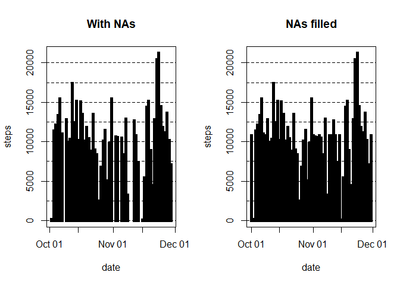

# Reproducible Research: Peer Assessment 1

Lets begin the exploration

## Loading and preprocessing the data
### Loading the data
Lets unzip and load the .csv file to R dataframe


```r
activity <- read.csv(unz("activity.zip", "activity.csv"))
sapply(activity, class)
```

```
##     steps      date  interval 
## "integer"  "factor" "integer"
```

### Process the data and transform if necessary

```r
activity$date <- as.Date(activity$date, format = "%Y-%m-%d")
suppressWarnings(library(zoo))
```

```
## 
## Attaching package: 'zoo'
```

```
## The following objects are masked from 'package:base':
## 
##     as.Date, as.Date.numeric
```

```r
is.regular(activity$date)
```

```
## [1] TRUE
```

```r
unique(activity$date)
```

```
##  [1] "2012-10-01" "2012-10-02" "2012-10-03" "2012-10-04" "2012-10-05"
##  [6] "2012-10-06" "2012-10-07" "2012-10-08" "2012-10-09" "2012-10-10"
## [11] "2012-10-11" "2012-10-12" "2012-10-13" "2012-10-14" "2012-10-15"
## [16] "2012-10-16" "2012-10-17" "2012-10-18" "2012-10-19" "2012-10-20"
## [21] "2012-10-21" "2012-10-22" "2012-10-23" "2012-10-24" "2012-10-25"
## [26] "2012-10-26" "2012-10-27" "2012-10-28" "2012-10-29" "2012-10-30"
## [31] "2012-10-31" "2012-11-01" "2012-11-02" "2012-11-03" "2012-11-04"
## [36] "2012-11-05" "2012-11-06" "2012-11-07" "2012-11-08" "2012-11-09"
## [41] "2012-11-10" "2012-11-11" "2012-11-12" "2012-11-13" "2012-11-14"
## [46] "2012-11-15" "2012-11-16" "2012-11-17" "2012-11-18" "2012-11-19"
## [51] "2012-11-20" "2012-11-21" "2012-11-22" "2012-11-23" "2012-11-24"
## [56] "2012-11-25" "2012-11-26" "2012-11-27" "2012-11-28" "2012-11-29"
## [61] "2012-11-30"
```


## What is mean total number of steps taken per day?

### Calculate total number of steps taken per day
Since the result is large, we are hiding it

```r
steps_day <- aggregate(steps ~ date, rm.na = TRUE, data = activity, FUN = sum)
```
### Make a histogram of number of steps taken per day

```r
plot(steps_day, type = "h", lwd = 10, lend = "square")
```

<!-- -->
### Calculate mean and median of the number of steps taken per day

We are not showing the results as its too large

```r
aggregate(steps ~ date, data = activity, FUN = mean)
aggregate(steps ~ date, data = activity, FUN = median)
```


## What is the average daily activity pattern?
### Make a time series plot (i.e. type = "l") of the 5-minute interval (x-axis) and the average number of steps taken, averaged across all days (y-axis)


```r
plot(aggregate(steps ~ interval, data = activity, FUN = mean), type = "l")
```

<!-- -->

### Which 5-minute interval, on average across all the days in the dataset, contains the maximum number of steps?


```r
max(activity$steps, na.rm = TRUE)
```

```
## [1] 806
```


## Imputing missing values
Note that there are a number of days/intervals where there are missing values (coded as NA). The presence of missing days may introduce bias into some calculations or summaries of the data.

### Calculate and report the total number of missing values in the dataset (i.e. the total number of rows with NAs)

```r
sum(is.na(activity))
```

```
## [1] 2304
```
### Devise a strategy for filling in all of the missing values in the dataset. The strategy does not need to be sophisticated. For example, you could use the mean/median for that day, or the mean for that 5-minute interval, etc.

I am going to substitute each NA with a fixed value. I set the fixed value equivalent to the overall mean of the variable activity$steps.

### Create a new dataset that is equal to the original dataset but with the missing data filled in.

```r
activity2 <- activity
sapply(activity2, class)
```

```
##     steps      date  interval 
## "integer"    "Date" "integer"
```


```r
activity2$steps[is.na(activity2$steps)] <- mean(na.omit(activity$steps))
activity2$date <- as.Date(activity2$date, format = "%Y-%m-%d")
```

### Make a histogram of the total number of steps taken each day and Calculate and report the mean and median total number of steps taken per day. Do these values differ from the estimates from the first part of the assignment? What is the impact of imputing missing data on the estimates of the total daily number of steps?


```r
steps_day2 <- aggregate(steps ~ date, rm.na = TRUE, data = activity2, FUN = sum)

par(mfrow = c(1, 2))
plot(steps_day, type = "h", lwd = 5,lend = "square", main = "With NAs")
abline(h = seq(0, 20000, 2500), lty = "dashed")
plot(steps_day2, type = "h", lwd = 5, lend = "square", main = "NAs filled")
abline(h = seq(0, 20000, 2500), lty = "dashed")
```

<!-- -->
Filling the NA makes the distribution more homogeneous. By the way, this operation could hide interesting patterns such as the inactivity during particular days of the week.


```r
aggregate(steps ~ date, data = activity, FUN = mean)
aggregate(steps ~ date, data = activity, FUN = median)
aggregate(steps ~ date, data = activity2, FUN = mean)
aggregate(steps ~ date, data = activity2, FUN = median)
```
The results, that I do not report because of the length, suggest that the strategy adopted to fill the missing values could be not adeguated. Indeed, new biases patterns evidently appear in the calculation operated on the activity2 dataset.
## Are there differences in activity patterns between weekdays and weekends?
For this part the weekdays() function may be of some help here. Use the dataset with the filled-in missing values for this part.

### Create a new factor variable in the dataset with two levels - "weekday" and "weekend" indicating whether a given date is a weekday or weekend day.


```r
activity2$weekday <- factor(format(activity2$date, "%A"))

levels(activity2$weekday) <- list(weekday = c("Monday", "Tuesday",
                                              "Wednesday", "Thursday",
                                              "Friday"), weekend =
                                          c("Saturday", "Sunday"))
```
### Make a panel plot containing a time series plot (i.e. type = "l") of the 5-minute interval (x-axis) and the average number of steps taken, averaged across all weekday days or weekend days (y-axis). See the README file in the GitHub repository to see an example of what this plot should look like using simulated data.


```r
par(mfrow = c(2, 1))

with(activity2[activity2$weekday == "weekend",], plot(aggregate(steps ~ interval, FUN = mean), type = "l", main = "Weekends"))

with(activity2[activity2$weekday == "weekday",], plot(aggregate(steps ~ interval, FUN = mean), type = "l", main = "Weekdays"))
```

<!-- -->

